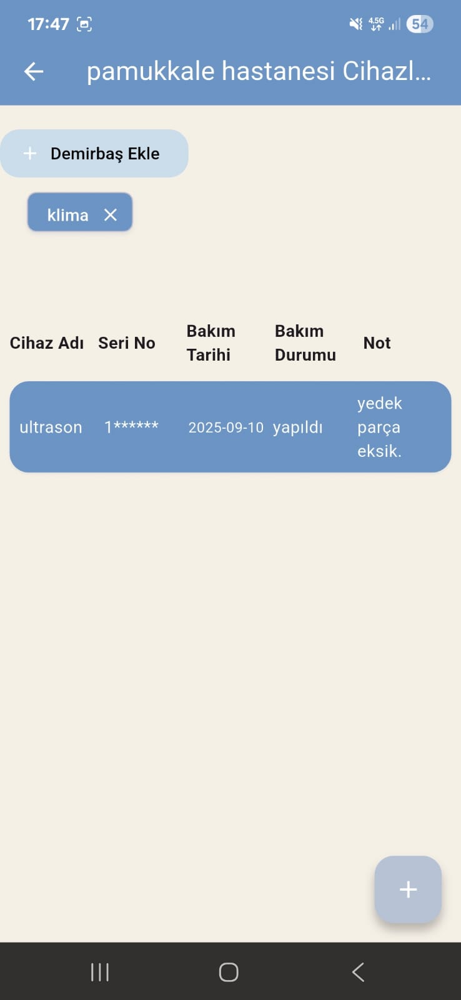

# 🏥 Hospital Device Maintenance Tracker
This mobile application is designed to track the maintenance and repair of devices used in hospitals.  
It is built with Flutter and works on Android platforms.

### ✨ Features
- 📋 Device list grouped by hospital
- 🔧 Device details (Name, Serial Number, Maintenance Date, Status, Notes)
- ➕ Add new device
- ✏️ Edit existing device information
- 🗑️ Delete device
- 📱 Modern and user-friendly interface

### 🛠️ Technologies
- [Flutter](https://flutter.dev/) (built with Dart)
- Material Design UI components

### 🚀 Installation
1. Clone this project:
   ```bash
   git clone https://github.com/username/hospital-device-tracker.git
   cd hospital-device-tracker
   
2. Install dependencies:
  ```bash
  flutter pub get
```
3. Run the app:
    ```bash
    flutter run
  
### 📷 Screenshots
  <p float="left">
  
  
</p>

    
